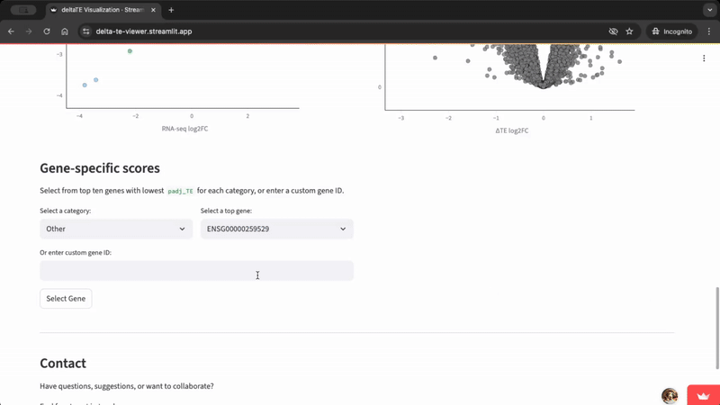

# deltaTE Project: Ribo-seq + RNA-seq Integration and Visualisation

This project is part of a personal learning process to learn and apply bioinformatics tools, specifically, examining translational efficiency using the deltaTE tool.

## Phase 1: Preprocessing and Quantification in Google Colab Notebook

Goal: Prepare RNA-seq and Ribo-seq gene-level expression estimates from raw FASTQ reads and run deltaTE.

Methods: Adapter trimming, abundant sequence filtering, pseudoalignment (e.g., Salmon), transcript-level quantification, converting transcript-level to gene-level counts, and deltaTE.

Libraries used include:
- SRA-toolkit
- Trimmomatic
- Fastx toolkit
- Bowtie2
- Salmon
- tximport
- FastQC and MultiQC
- deltaTE

### View the project:

[](https://colab.research.google.com/github/emmanuel-tan/deltaTE-qc-visualisation/blob/main/deltaTe_analysis.ipynb)

⚠️ Note:
Colab is great for testing small data or exploring the workflow logic, but it's not practical for full-scale, production-level analyses. Storage limits, session timeouts, and limited CPU/RAM mean real datasets are better run locally or on a cluster.

## Phase 2: Differential TE Analysis Visualisation in Webapp
Goal: Create an interactive way to examine deltaTE results.

Resulting Streamlit site provides:
- Interactive visualisations of deltaTE output for result exploration
- Top gene lists classified by regulatory pattern (exclusive TE changes, buffering, etc.)

### Load data


### View interactive plot


### View top genes


### [Check out the web app](https://delta-te-viewer.streamlit.app/)

## Phase 3: Containerisation

I also created Dockerized implementation of deltaTE. The Docker image includes all necessary R dependencies (e.g. DESeq2, ggplot2) and the deltaTE script, allowing you to run reproducible analyses without manual setup.

### Requirements

- Docker installed
- Input files (same as original script requires):
  - RNA-seq counts 
  - Ribo-seq counts
  - Sample info file

### Quick start
1. Pull the Docker image

```bash
docker pull 107laserfish/deltate-bioconductor:latest 
# add the "--platform amd64" parameter if you are running on a M-series Mac
```

2. Run deltaTE

Assuming your input files are in the current directory:

```bash
docker run --rm \
# --platform linux/amd64 \ # if running on a M-series Mac  
  -v $(pwd):/home/ruser/data \
  -v $(pwd)/results:/home/ruser/Results \
  107laserfish/deltate-bioconductor:latest \
    /home/ruser/data/rna_counts.txt \
    /home/ruser/data/ribo_counts.txt \
    /home/ruser/data/sample_info.txt 1
```


### Contact
Feel free to contact me with any feedback, comments, or ideas at emmanueltan2000@gmail.com or on [Linkedin](https://www.linkedin.com/in/emmanuel-tan-0b89051b3/)